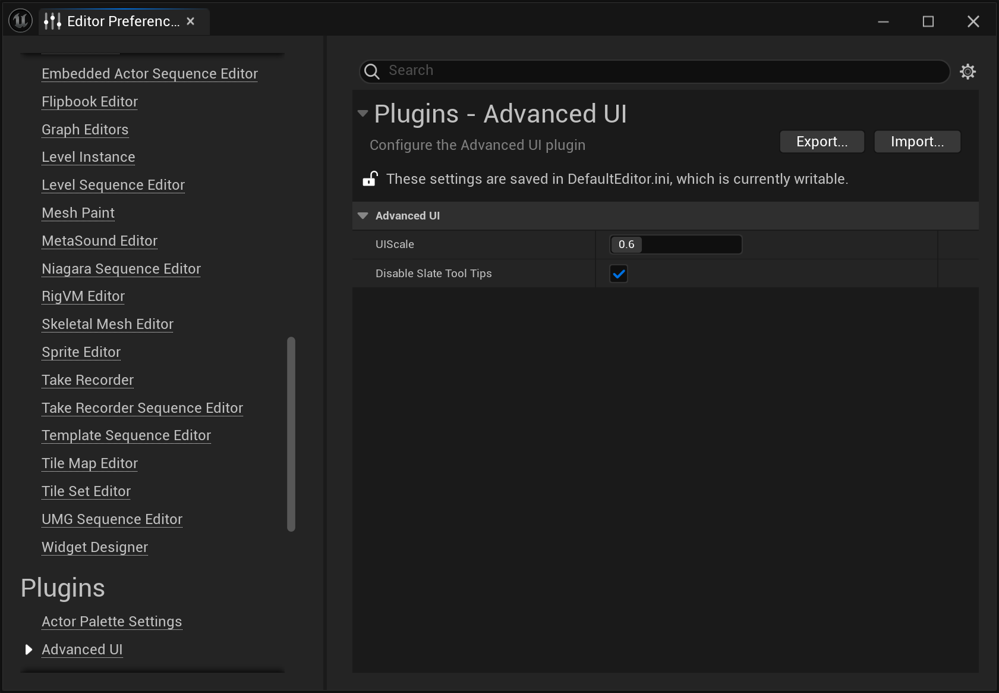

# AdvancedUI

Unreal Engine 5 Advanced UI Editor.
it to start working
This Unreal Engine Plugin allows setting a custom and persistent UI scale for the editor
as well as allowing you to disable Slate UI tooltips in the editor (probably only useful for Linux).

## Engine Installation

You can download the ZIP archive of this plugin and extract it **outside** the Unreal Engine directory.

Installation this way will require you to compile the Plugin manually.

### IDE Compiation

You can compile the plugin in your IDE by generating the project files for the plugin and building it
(similar to how you would build a C++ Unreal Engine Project).

Once compiled you'll need to copy the build of the plugin to the Plugins directory of the Engine:

```
<ENGINE_ROOT>/Engine/Plugins/AdvancedUI
```

### Command-line Compilation

You can compile it on the command line with:

```bash
<ENGINE_ROOT>/Engine/Build/BatchFiles/RunUAT.bat BuildPlugin -Plugin=<PLUGIN_ROOT_DIR>/AdvancedUI.uplugin -Package=<PLUGIN_ROOT_DIR>/Out/AdvancedUI
```

Then, copy the `<PLUGIN_ROOT_DIR>/Out/AdvancedUI` directory to `<ENGINE_ROOT>/Engine/Plugins/AdvancedUI`.

### Enabling the Plugin

Insatllation as an engine plugin will not enable the plugin by default. You can enable the plugin from inside the editor
by going to **Edit** -> **Plugins** and enabling the **Advanced UI** Plugin.
Once enabled, you will also need to restart the editor for the plugin to start working.

## Project Installation

If you're using Git for source control on your project you can add it to the project with:

```bash
git submodule add https://github.com/nikkomiu/AdvancedUI.git Plugins/AdvancedUI
```

Afterwards, the next compilation of your project should automatically compile, register and enable the plugin.

### Auto-Enable Plugin

Engine installation offers the ability to auto-enable the plugin on your system as opposed to enabling it on a per-project basis. To enable the plugin globally, edit the `AdvancedUI.uplugin` that was **built** and add the `EnabledByDefault` flag with a value of `true`:

```diff
     "IsBetaVersion": false,
+    "EnabledByDefault": true,
     "IsExperimentalVersion": false,
```

It seems like this can't be done before the build of the plugin as the UE build tool doesn't seem to honor that field.

## Usage

This plugin has a very simple configuration. Once enabled you can configure it through **Edit** -> **Editor Preferences...** -> **Plugins** -> **Advanced UI**.


